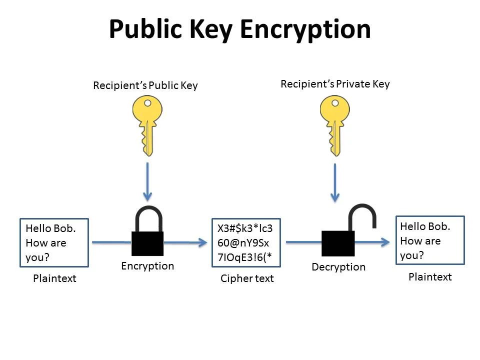
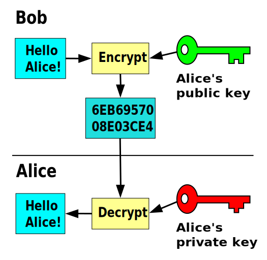
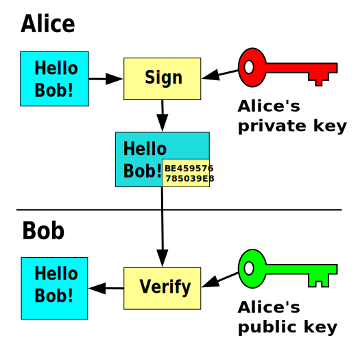
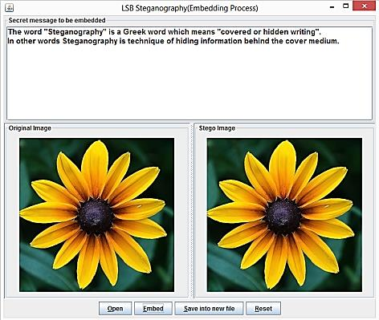

# H4: Confidentiality

## De kunst van het beschermen van geheimen.

---

# 4.1 Cryptografie

---

## Cryptografie vs. cryptanalyse


Notes:

-   https://sectigostore.com/blog/cryptology-vs-cryptography-whats-the-difference/

---

## Cryptografie

-   Cryptologie
    -   **wetenschap** maken en breken **geheime codes**
-   Cryptografie
    -   **manier** om gegevens **op te slaan** en te verzenden, zodat alleen de ontvanger deze kan lezen
    -   Moderne cryptografie: gebruik van algoritmen om gevoelige data te beschermen
    -   Veel **ouder dan computers** (duizenden jaren)
-   Crypto-analyse:
    -   **kraken** van cryptografie

Notes:

-   **Cryptologie** is de wetenschap van het maken en breken van geheime codes. **Cryptografie** is een manier om gegevens op te slaan en te verzenden, zodat alleen de beoogde ontvanger deze kan lezen of verwerken. Moderne cryptografie maakt gebruik van computationeel beveiligde algoritmen om ervoor te zorgen dat cybercriminelen niet gemakkelijk beschermde informatie kunnen compromitteren.

-   De geschiedenis van cryptografie begon duizenden jaren geleden in diplomatieke kringen. Boodschappers van het hof van een koning brachten versleutelde berichten naar andere rechtbanken. Af en toe probeerden andere rechtbanken die niet bij de communicatie betrokken waren, berichten te stelen die waren verzonden naar een koninkrijk dat zij als een tegenstander beschouwden. Niet lang daarna begonnen militaire commandanten encryptie te gebruiken om berichten te beveiligen.

-   Elke versleutelingsmethode gebruikt een specifiek algoritme, een cijfer genaamd, om berichten te versleutelen en te ontsleutelen. Een cijfer is een reeks goed gedefinieerde stappen die worden gebruikt om berichten te versleutelen en ontsleutelen. Er zijn verschillende methoden om cijfertekst te maken:
    -   Transpositie (omzetting)
    -   Substitutie (vervanging)
    -   Eenmalige pad

---

## Encrypteren

-   Om vertrouwelijkheid (confidentiality) te garanderen kunnen we een bericht **encrypteren** met behulp van een specifiek algoritme (cipher)
-   Hierbij wordt een bericht dat we kunnen begrijpen (**plaintext**) omgezet naar een onleesbaar bericht (**ciphertext**) via een aantal goed gedefinieerde stappen (algoritme), vaak met behulp van een geheime sleutel (**key**).


---

## Decrypteren

-   Het omgekeerde is ook mogelijk, **decrypteren** zet een onleesbaar bericht terug om naar de originele leesbare tekst.
-   Voor encrypteren en decrypteren wordt vaak een **combinatie** gebruikt van verschillende **technieken**:
    -   Transpositie (omzetting)
    -   Substitutie (vervanging)
    -   One-time pad


---

## Transpositie

-   Eenvoudig voorbeeld van **transpositie** waarbij de volgorde van de karakters wijzigt (cfr. transpositie van een matrix, AT)


---

## Substitutie

-   Voorbeelden **substitutie** waarbij karakters vervangen worden door andere karakters


Notes:

Je kan dit zelf uittesten op https://rot13.com . ROT13 wordt ook wel het Ceasar Cipher genoemd. Meer informatie hierover vind je op https://en.wikipedia.org/wiki/ROT13 .

---

## One-time pad

-   Voorbeeld one-time pad waarbij een random **sleutel (pad)** toegevoegd wordt
    aan de plaintext
-   Nadien wordt het resultaat omgezet naar een getal van 2 cijfers


Notes:

-   https://www.teach.cs.toronto.edu/~csc110y/fall/notes/08-cryptography/02-one-time-pad.html

Een uitgebreide uitleg voor beginners waarom transpositie en substitutie niet ideaal zijn en hoe een one-time pad dit oplost, vind je op youtube:

-   https://www.youtube.com/watch?v=2_w9l9visH8 (deel 1)
-   https://www.youtube.com/watch?v=M8Tf9_O7s9c (deel 2)

---


---

<iframe width="1280" height="720" src="https://www.youtube.com/embed/FlIG3TvQCBQ?si=cFd4aNQzkrxme8pQ" title="YouTube video player" frameborder="0" allow="accelerometer; autoplay; clipboard-write; encrypted-media; gyroscope; picture-in-picture; web-share" referrerpolicy="strict-origin-when-cross-origin" allowfullscreen></iframe>

---

## Randomheid

-   One time pad kan gekraakt worden als er een **patroon** in de sleutel zit
    -   De sleutel moet volledig **random** zijn
-   Mensen zijn heel slecht in randomheid
    -   Probeer het zelf eens uit
        -   https://www.loper-os.org/bad-at-entropy/manmach.html
        -   https://www.expunctis.com/2019/03/07/Not-so-random.html

Notes:

-   https://www.psychologytoday.com/us/blog/dear-life-please-improve/202106/why-we-get-randomness-so-wrong
-   https://www.youtube.com/watch?v=tP-Ipsat90c
-   https://crypto.stackexchange.com/a/87982

---

## Pseudorandom

-   Computers zijn deterministisch
    -   we maken ze juist heel precies zodat ze altijd hetzelfde uitkomen
-   Computers bevatten **pseudorandom** generators
    -   Spuwen op basis van een startgetal (**seed**) schijnbaar random getallen uit
    -   Zelfde seed geeft dezelfde reeks "random" getallen
        -   Probeer het zelf eens uit
            -   https://asecuritysite.com/primes/twister

Notes:

-   https://blog.cloudflare.com/why-randomness-matters/

---

-   Seeds wordt heel vaak gebruikt in games
    -   Randomheid in AI, omgeving, ...
        -   Gebruiken bv. tijd van spelen als seed
    -   Genereren van werelden


Notes:

-   https://www.wikihow.com/Use-Seeds-in-Minecraft
-   https://www.youtube.com/watch?v=GaRurhiK-Lk
-   https://www.youtube.com/watch?v=yV9gzs7_-N4

---

-   Pseudorandom algoritmes zijn **zeer moeilijk** om correct op te stellen
-   Vaak wordt er gebruik gemaakt van **natuurlijke** random fenomenen
    -   bv. https://random.org biedt random getallen aan op basis van atmosferische ruis
    -   bv. Cloudflare filmt een muur van lavalampen en zet die om naar random getallen


Notes:

-   https://www.cloudflare.com/learning/ssl/lava-lamp-encryption/
-   https://blog.cloudflare.com/randomness-101-lavarand-in-production/

---

## Twee types algoritmen

-   **Symmetrische** algoritmen
    -   **Zelfde sleutel** voor encrypteren (versleutelen) en decrypteren
    -   Verzender en afzender **kennen de sleutel** voor communicatie begint
        -   Groot nadeel: hoe wissel je deze veilig uit?


Notes:

Er zijn twee soorten versleutelingsalgoritmen:

-   **Symmetrische** algoritmen gebruiken dezelfde vooraf gedeelde sleutel, ook wel een geheim sleutelpaar genoemd, om gegevens te encrypteren (versleutelen) en te decrypteren (ontgrendelen). Zowel de afzender als de ontvanger kennen de vooraf gedeelde sleutel voordat er gecodeerde communicatie begint. Dit geeft wel een groot nadeel: hoe wissel je op voorhand veilig de sleutel uit? Dit moet via een ander communicatiemiddel dan hetgeen je wil encrypteren. Als je bijvoorbeeld vermoed dat jouw e-mailverkeer wordt afgeluisterd, kan je niet via e-mail de encryptiesleutel doorgeven. Je spreekt het beste af in het echt om elkaar persoonlijk de encryptiesleutel door te geven: zo ben je zeker dat niemand de sleutel heeft onderschept of gekopieerd en dat de sleutel aan de juiste persoon is afgegeven. Als de ontvanger aan de andere kant van de wereld woont, wordt dit natuurlijk een pak moeilijker. Dit belangrijk nadeel aan symmetrische encryptie wordt opgelost dankzij asymmetrische encryptie, maar wel met een extra kost qua rekenkracht en tijd om te encrypteren en te decrypteren.

---

-   **Asymmetrische** algoritmen
    -   **Sleutelpaar**:verschillende sleutels voor encrypteren en decrypteren
        -   1 sleutel is **publiek** (openbaar), andere is **privé**
        -   Hoeft geen sleutel op voorhand uit te wisselen
            -   Niet het grote nadeel van symmetrische encryptie
            -   Wel complexer en dus **trager** dan symmetrische algoritmen


Notes:

-   **Asymmetrische** algoritmen gebruiken twee sleutels: een sleutel om gegevens te encrypteren/versleutelen en een andere sleutel om gegevens te decrypteren/ontgrendelen. De ene sleutel is openbaar en de andere is privé. In een coderingssysteem met openbare sleutel kan elke persoon een bericht coderen met de openbare sleutel van de ontvanger, en de ontvanger is de enige die het kan decoderen met zijn privésleutel. Partijen wisselen beveiligde berichten uit zonder een vooraf gedeelde sleutel nodig te hebben. Asymmetrische algoritmen zijn complexer. Deze algoritmen zijn arbeidsintensief en trager uit te voeren. Ze bieden wel een oplossing voor het probleem van het veilig uitwisselen van sleutels dat zich voordoet bij symmetrische algoritmen.

---

-   Ook **publieke-sleutel-cryptografie** genoemd
    -   Iedereen kan bericht encrypteren met publieke sleutel, enkel ontvanger kan decrypteren met private sleutel



---

## Verschil tussen de 2 types


---

## Private-key versleuteling (symmetrisch)

-   Data Encryption Standard (**DES**)
    -   Eenvoudig, encrypteert 64-bits blokken met 56-bits sleutel
    -   Niet bruikbaar in praktijk, **niet veilig**!
-   Triple DES (**3DES**)
    -   3x DES met verschillende sleutels
    -   Sleutelsterkte: ~~3x56 = 168 bits~~ in praktijk 112-168 bits afhankelijk van gekozen combinatie
    -   Niet bruikbaar in praktijk, **niet veilig**!

Notes:

Symmetrische algoritmen gebruiken een vooraf gedeelde sleutel om gegevens te encrypteren en decrypteren, een methode die ook bekend staat als versleuteling met een privésleutel. Talrijke versleutelingssystemen gebruiken symmetrische versleuteling. Enkele van de algemene coderingsstandaarden die symmetrische codering gebruiken, zijn onder meer:

-   3DES (Triple DES): Digital Encryption Standard (DES) is een symmetrische blokversleuteling met een 64-bits blokgrootte die een 56-bits sleutel gebruikt. Triple DES versleutelt gegevens driemaal en gebruikt een andere sleutel voor ten minste één van de drie passages, waardoor het een cumulatieve sleutelgrootte krijgt van 112-168 bits.
-   IDEA: Het International Data Encryption Algorithm (IDEA) gebruikt 64-bits blokken en 128-bits sleutels. IDEA voert acht transformatieronden uit op elk van de 16 blokken die het resultaat zijn van het verdelen van elk 64-bits blok. IDEA was de vervanging voor DES, en nu gebruikt PGP (Pretty Good Privacy) het.
-   AES: De Advanced Encryption Standard (AES) heeft een vaste blokgrootte van 128 bits met een sleutelgrootte van 128, 192 of 256 bits. Het National Institute of Standards and Technology (NIST) keurde het AES-algoritme in december 2001 goed. De Amerikaanse overheid gebruikt AES om geheime informatie te beschermen.

Er worden hier enkele termen gebruikt:

-   Aantal bits per blok: Het aantal bits dat in 1 keer door het encryptie-algoritme wordt geëncrypteerd. Indien een bestand groter is dan de blokgrootte, wordt dat bestand in blokken gekapt en blok per blok geëncrypteerd.
-   Aantal bits voor de sleutel: Hoe meer bits de sleutel bevat, hoe moeilijker het is om het encryptie-algoritme is te kraken.

---

-   International Data Encryption Algorithm (**IDEA**)
    -   64-bits blokken met 128-bits sleutel
    -   Vervanging voor DES, gebruikt bij PGP (Pretty Good Privacy)
    -   **Veilig** op dit moment
-   Advanced Encryption Standard (**AES**)
    -   128-bits blokken, sleutel van 128, 192 of 256 bits
    -   Goedgekeurd door NIST, gebruikt door Amerikaanse overheid
    -   **Veilig** op dit moment
    -   Op dit moment meest aangeraden (bv. voor performantie, implementeerbaarheid, ...)

---

## Public-key versleuteling (asymmetrisc)

-   Rivest Shamir Adleman (**RSA**)
    -   Gebruikt product van 2 heel grote priemgetallen
    -   Vaak gebruikt in browsers
    -   **Veilig** op dit moment
-   Elliptic Curve Cryptography (**ECC**)
    -   Alternatief voor RSA: Nulpunten van elliptische curven i.p.v. priemgetallen
    -   NSA gebruikt dit voor handtekeningen en uitwisselen sleutels
    -   **Veilig** op dit moment
    -   Wordt meer en meer gebruikt i.p.v. RSA vanwege kleinere sleutels.

Notes:

Asymmetrische codering, ook wel codering met openbare sleutel genoemd, gebruikt één sleutel voor codering die verschilt van de sleutel die wordt gebruikt voor decodering. Een crimineel kan de decoderingssleutel niet binnen een redelijke tijd berekenen op basis van kennis van de coderingssleutel en vice versa. De asymmetrische algoritmen zijn onder meer:

-   RSA (Rivest Shamir-Adleman): gebruikt het product van twee zeer grote priemgetallen met een gelijke lengte tussen 100 en 200 cijfers. Browsers gebruiken RSA om een veilige verbinding tot stand te brengen.
-   Elliptic Curve Cryptography (ECC): gebruikt elliptische curven als onderdeel van het algoritme. In de VS gebruikt de National Security Agency ECC voor het genereren van digitale handtekeningen en het uitwisselen van sleutels.
-   Diffie-Hellman: biedt een elektronische uitwisselingsmethode om de geheime sleutel te delen. Beveiligde protocollen, zoals Secure Sockets Layer (SSL), Transport Layer Security (TLS), Secure Shell (SSH) en Internet Protocol Security (IPsec), gebruiken Diffie-Hellman.
-   ElGamal: gebruikt de Amerikaanse overheidsstandaard voor digitale handtekeningen. Dit algoritme is gratis te gebruiken omdat niemand het patent heeft.

Er worden hier enkele termen gebruikt:

-   SSL / TLS: Een encryptie-algoritme dat bijvoorbeeld gebruikt wordt in HTTPS (beveiligd surfen op het internet).
-   SSH: Een manier om op een veilige manier vanop afstand in te loggen op toestel en deze te beheren alsof je er zelf ter plekke aan zit.
-   IPsec: Een vaak gebruikt protocol voor VPN's.

---

-   **Diffie-Hellman**
    -   Gebruikt om geheime sleutel (sessiesleutel) voor symmetrisch algoritme **veilig uit te wisselen**
    -   Vaak gebruikt: SSL, TLS, SSH, IPSec, ...
    -   **Veilig** op dit moment
-   **El Gamal**
    -   Amerikaanse overheidsstandaard voor digitale handtekeningen
    -   Niemand heeft patent ...
        -   Vroeger was er een patent op RSA (nu niet meer)
        -   Werd daarom gebruikt bij PGP (Pretty Good Privacy)
    -   **Veilig** op dit moment

---

## Symmetrische vs. asymmetrische codering

| Symmetrisch | Asymmetrisch |
| ----------------------------------------------------------------------------------- | ------------------------------------------------------------------------------------------------- |
| <span style="color: green">Snel</span> | <span style="color: green">Niet nodig om beide sleutels te delen</span> |
| <span style="color: green">Verbruikt weinig resources</span> | <span style="color: green">Kan gebruikt worden voor encryptie en validatie (=handtekening)</span> |
| <span style="color: green">Kan gebruikt worden voor korte en lange berichten</span> | <span style="color: red">Gebruikt veel resources</span> |
| <span style="color: red">Sleutel moet op veilige manier gedeeld worden</span> | <span style="color: red">Enkel bruikbaar voor relatief kleine berichten</span> |

Notes:

Het is belangrijk om de verschillen tussen symmetrische en asymmetrische versleutelingsmethoden te begrijpen.

-   Symmetrische versleutelingssystemen zijn efficiënter en kunnen meer gegevens verwerken. Sleutelbeheer met symmetrische versleutelingssystemen is echter problematischer en moeilijker te beheren.
-   Asymmetrische cryptografie is efficiënter in het beschermen van de vertrouwelijkheid van kleine hoeveelheden gegevens, en de grootte en snelheid ervan maken het veiliger voor taken zoals elektronische sleuteluitwisseling, wat een kleine hoeveelheid gegevens is in plaats van grote blokken gegevens te versleutelen.

---

## In de praktijk

1. We gebruiken **asymmetrisch encryptie** om een geëncrypteerde tunnel op te zetten
2. We gebruiken dan **Diffie-Hellman** om via de tunnel een gemeenschappelijke symmetrische sessie-sleutel te genereren zonder onze private keys uit te wisselen
3. We gebruiken daarna de **symmetrische sessiesleutel** om een (snellere) geëncrypteerde tunnel op te zetten

-   Een "**tunnel**" betekent dat we berichten in een enkele of beide richting encrypteren. Anderen kunnen deze berichten niet lezen. Het lijkt alsof we een eigen tunnel hebben voor onze berichten door het internet.

---

```mermaid
flowchart LR
    AE[Asymmetrisch encryptie] --> DH[Diffie-Hellman] --> SE[Symmetrische encryptie]
```

---

## Public-key versleuteling

-   Encrypteren (encrypt/decrypt)
-   Digitale handtekening (sign/verify).




Notes:

-   Bij asymmetrische algoritmen heeft elke gebruiker een public en private key. De public key mag iedereen zien. Je kan deze op internet posten op sociale media of websites, onder jouw groet in e-mails, doorgeven als QR code op een visitekaartje, ... . Anderen gebruiken immers deze sleutel om berichten naar jou te encrypteren.
-   De private key mag **niemand** zien! Deze gebruik jij om voor jou geëncrypteerde berichten te decrypteren zodat je deze kan lezen. Als iemand jouw private key te pakken krijgt, dan kan die ook jouw verkeer decrypteren en lezen. Als jouw private key gelekt is, zal je jouw sleutels moeten weggooien en nieuwe genereren. Ook moet je dan iedereen op de hoogte brengen dat deze sleutels gelekt zijn: dit kan je doen met behulp van een revocation certificate.

-   Asymmetrische algoritmen kunnen naast encrypteren ook digitale handtekeningen genereren. Met een handtekening kan je bewijzen dat:
    -   Het bericht of bestand daadwerkelijk van jou afkomstig is.
    -   Het bericht of bestand niet is gemanipuleerd of bewerkt door iemand anders nadat de handtekening er op is gezet.
-   Je kan met behulp van iemand zijn public key controleren of diens handtekening klopt. Zelf genereer je jouw handtekeningen met jouw private key. Ook hiervoor is het belangrijk dat niemand jouw private key te pakken heeft! Als iemand jouw private key heeft, kan die in jouw naam berichten handtekenen en dus jouw indentiteit stelen! Digitale handtekening komen in een verder hoofdstuk terug aan bod.

---

## Diffie Hellman

-   Wordt gebruikt om met asymmetrische algoritmen een symmetrische sleutel te genereren
    -   De private key wordt **nooit** getoond aan de andere partij!
    -   Toch bekomen beide partijen dezelfde sleutel als resultaat


Notes:

Vaak wordt er gebruik gemaakt van asymmetrische systemen om een symmetrische sleutel af te spreken om de rest van de communicatie via symmetrische encryptie te encrypteren. Dankzij de asymmetrische encryptie kan niemand het afspreken van de sleutel afluisteren en dankzij de verdere symmetrische encryptie is de overhead van de encryptie op vlak van nodige rekenkracht en tijd zo klein mogelijk. Het afspreken van een symmetrische sleutel via asymmetrische encryptie gebeurd meestal via Diffie Hellman, Dit algoritme wordt vaak uitgelegd aan de hand van het mengen van verf (bijvoorbeeld https://www.youtube.com/watch?v=YEBfamv-_do of https://www.youtube.com/watch?v=NmM9HA2MQGI ). Een wiskundige uitleg kan je vinden op https://www.youtube.com/watch?v=Yjrfm_oRO0w .

---


Notes:

- https://xkcd.com/538/

---

# 4.2 cryptanalyse

---

## Het kraken van cryptografie

-   Bij het **kraken** van cryptografie probeer je een onleesbaar bericht (ciphertext) om te vormen naar een leesbaar bericht (plaintext) **zonder** dat je de **geheime sleutel** kent
-   In sommige gevallen zelfs zonder dat je weet **welk algoritme** gebruikt is voor de encryptie
-   In theorie kan je elk algoritme kraken, maar de kans op succes hangt af van 2 factoren:
    -   De hoeveelheid **tijd** die je hebt voor het bericht irrelevant wordt
    -   De hoeveelheid **bronnen** (bv. CPU, GPU, storage, ...) die je kan gebruiken

---

## Technieken

-   Soms is het mogelijk om algoritmen te kraken door **op zoek** te gaan naar **bepaalde patronen** in de ciphertext (zo is de Enigma gekraakt door Alan Turing!)


Notes:

-   https://en.wikipedia.org/wiki/Cryptanalysis_of_the_Enigma

---

-   Voor het kraken van moderne algoritmen worden vaak volgende technieken gebruikt:
    -   **Dictionary attack**: uitproberen van verschillende waarden uit een opgegeven lijst
        -   bv. woordenboek of dump van wachtwoorden
    -   **Brute-force attack**: uitproberen van alle mogelijke waarden voor de geheime sleutel
        -   heel tijdsintensief!
    -   **Rainbow tables**: gebruikt vooraf gemaakte, gesorteerde lijsten met ciphertext en de overeenkomstige plaintext
        -   wordt gebruikt voor het kraken van hashing algoritmen

---

## CPU, GPU, AI of quantum computing?

-   De bewerkingen nodig voor het kraken van een modern algoritme zijn vaak **veel efficiënter** uit te voeren op een **GPU** dan een CPU (en dus veel sneller!)
-   De opkomst van **AI** kan mogelijks in de toekomst een grote rol spelen bij het kraken van encryptie, als AI modellen hiervoor getraind kunnen worden (bv. door training met vaak gebruikte wachtwoorden)
-   Verwacht wordt ook dat **quantum computing** veel algoritmen voor encryptie onbruikbaar zal maken, maar dit is nog niet voor morgen ...
    -   Toch wordt op dit moment al veel geëncrypteerde data opgeslagen zodat deze later gekraakt kan worden!

Notes:

-   How Quantum Computers Break The Internet... Starting Now: https://www.youtube.com/watch?v=-UrdExQW0cs

---

## Enkele tools

-   John The Ripper
    -   Kraken van zwakke wachtwoorden via een hash (bv: kraken van geëncrypteerde ZIP-file via hashwaarde)
    -   Maakt gebruik van **dictionary attacks** via een woordenboek en/of **bruteforce** attacks
    -   Geoptimaliseerd voor kraken via **CPU**, beperkte ondersteuning voor GPU


---

-   Hashcat
    -   Functionaliteit vergelijkbaar met John The Ripper
    -   Geoptimaliseerd voor kraken van wachtwoorden via **GPU**


---

# 4.3 Data verduisteren

---

## Gegevensmarkering (masking)

-   Gevoelige data **vervangen** door niet-gevoelige data
-   Niet-gevoelige versie ziet eruit en gedraagt zich als het origineel
    -   Geen wijzigingen nodig aan applicaties of data-opslagfaciliteiten
-   Vaak gebruikt voor testen en analyse zonder privacyrisico
-   Verschillende **technieken** om gegevens te wijzigen, maar zinvol te houden:
    -   **Vervanging** vervangt gegevens door authentiek ogende waarden (garanderen anonimiteit)
    -   **Shuffling** verwisselt data van verschillende gebruikers
        -   Werkt goed voor bijvoorbeeld financiële data in een testdatabase

Notes:

-   Datamaskering of gegevensmaskering is een technologie die gegevens beveiligt door gevoelige informatie te vervangen door een niet-gevoelige versie. De niet-gevoelige versie ziet eruit en gedraagt zich als het origineel. Dit betekent dat een bedrijfsproces gebruik kan maken van niet-gevoelige data en dat het niet nodig is om de ondersteunende applicaties of dataopslagfaciliteiten te wijzigen.
-   In het meest voorkomende geval beperkt maskering de verspreiding van gevoelige gegevens binnen IT-systemen door vervangende gegevenssets te distribueren voor testen en analyse.
-   Er zijn technieken voor gegevensmaskering die ervoor kunnen zorgen dat gegevens zinvol blijven, maar voldoende worden gewijzigd om ze te beschermen:
    -   Vervanging: vervangt gegevens door authentiek ogende waarden om anonimiteit toe te passen op de gegevensrecords.
    -   Shuffling: leidt een vervangingsset af uit dezelfde kolom met gegevens die een gebruiker wil maskeren. Deze techniek werkt goed voor bijvoorbeeld financiële informatie in een testdatabase.

---


---

## Steganografie

-   **Verbergt** gegevens in een ander bestand
    -   bv. grafisch, audio-, of ander tekstbestand
-   Geheime boodschap **valt niet op**
    -   Niemand zou ooit weten dat een foto daadwerkelijk een geheime boodschap bevatte door het bestand elektronisch of op papier te bekijken


Notes:

-   https://ctf101.org/forensics/what-is-stegonagraphy/

---


---

-   Verschillende **componenten** betrokken:
    -   **Ingebedde** gegevens = geheim bericht
    -   **Omslagtekst** verbergt gegevens die de **stego-tekst** produceren
        -   Omslag en/of verborgen gegevens kunnen ook afbeelding of audio zijn
    -   **Stego-key** regelt het verbergingsproces



Notes:

-   Steganografie verbergt gegevens (het bericht) in een ander bestand, zoals een grafisch, audio- of ander tekstbestand.
-   Het voordeel van steganografie boven cryptografie is dat de geheime boodschap geen speciale aandacht trekt. Niemand zou ooit weten dat een foto daadwerkelijk een geheime boodschap bevatte door het bestand elektronisch of op papier te bekijken.
-   Er zijn verschillende componenten betrokken bij het verbergen van gegevens:
    -   Er zijn de ingebedde gegevens, dat is het geheime bericht.
    -   Omslagtekst (of omslagafbeelding of omslagaudio) verbergt de ingebedde gegevens die de stego-tekst produceren (of stego-afbeelding of stego-audio).
    -   Een stego-key regelt het verbergingsproces.

---

## Gegevensverduistering (obfuscation)

-   Toepassen gegevensmaskering en steganografietechnieken
    -   **Verduistering** maakt de boodschap verwarrend, dubbelzinnig of moeilijker te begrijpen
    -   Systeem kan opzettelijk berichten **door elkaar halen**


Notes:

-   Gegevensverduistering is het gebruik en de praktijk van gegevensmaskering en steganografietechnieken in het beroep van cyberbeveiliging en cyberinformatie:
    -   Verduistering is de kunst om de boodschap verwarrend, dubbelzinnig of moeilijker te begrijpen te maken.
    -   Een systeem kan opzettelijk berichten door elkaar halen om ongeautoriseerde toegang tot gevoelige informatie te voorkomen.
-   https://www.preemptive.com/obfuscation/

---

## Voorbeeld: JavaScript Obfuscator

```js
function hi() {
    console.log("Hello World!");
}
hi();
```

Notes:

-   Code Obfuscation kan heel nuttig zijn voor broncode die niet gecompileerd wordt, zoals bijvoorbeeld JavaScript of PHP (en de meeste interpreter-gebaseerde talen). Deze slides tonen een voorbeeld van obfuscation van een eenvoudig stuk JavaScript code. Dit is geen fictief voorbeeld, de code op de volgende slide is werkende JavaScript code!

---

- Je kan dit zelf uittesten op https://obfuscator.io/#code

```js
(function(_0x3769eb,_0x23bae9){var _0xda3c79=_0x3291,_0x12283b=_0x3769eb();while(!![]){try{var _0x244366=parseInt(_0xda3c79(0x13f))/0x1+-parseInt(_0xda3c79(0x138))/0x2*(parseInt(_0xda3c79(0x13c))/0x3)+parseInt(_0xda3c79(0x142))/0x4+-parseInt(_0xda3c79(0x141))/0x5*(parseInt(_0xda3c79(0x13e))/0x6)+parseInt(_0xda3c79(0x13d))/0x7+-parseInt(_0xda3c79(0x13a))/0x8+-parseInt(_0xda3c79(0x139))/0x9*(parseInt(_0xda3c79(0x140))/0xa);if(_0x244366===_0x23bae9)break;else _0x12283b['push'](_0x12283b['shift']());}catch(_0xfc1341){_0x12283b['push'](_0x12283b['shift']());}}}(_0x5ed3,0xb180b));function hi(){var _0x289339=_0x3291;console[_0x289339(0x13b)](_0x289339(0x143));}function _0x5ed3(){var _0x3c41ee=['7801712AKCSru','log','3qjtjdY','8726522UjJliE','5213586ChpIqU','1186209XwtNov','7440XEBidU','5TbAVFc','4305648VWGpzc','Hello\x20World!','1611278QJXdTF','1602bezzPL'];_0x5ed3=function(){return _0x3c41ee;};return _0x5ed3();}function _0x3291(_0x41aaaf,_0x2efa74){var _0x5ed382=_0x5ed3();return _0x3291=function(_0x3291eb,_0x5197cf){_0x3291eb=_0x3291eb-0x138;var _0x5c36e3=_0x5ed382[_0x3291eb];return _0x5c36e3;},_0x3291(_0x41aaaf,_0x2efa74);}hi();
```

---
