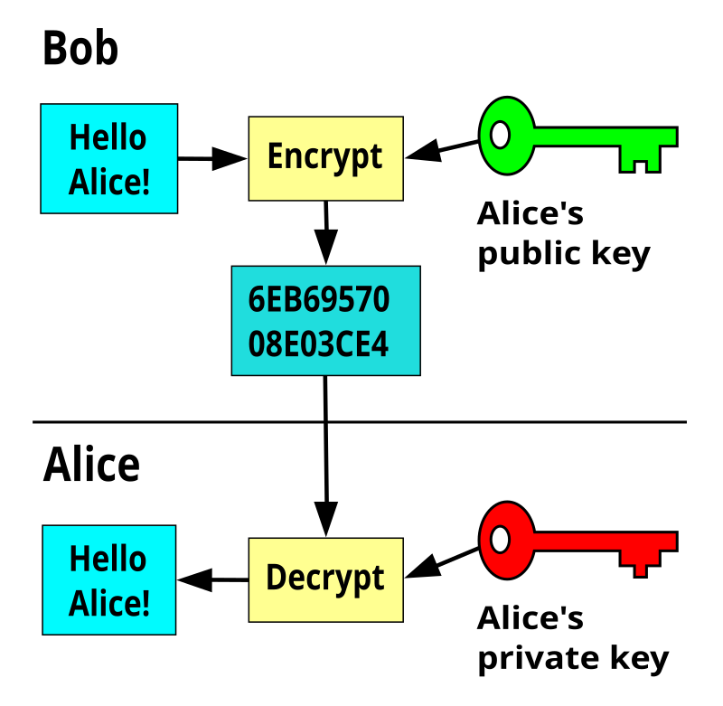
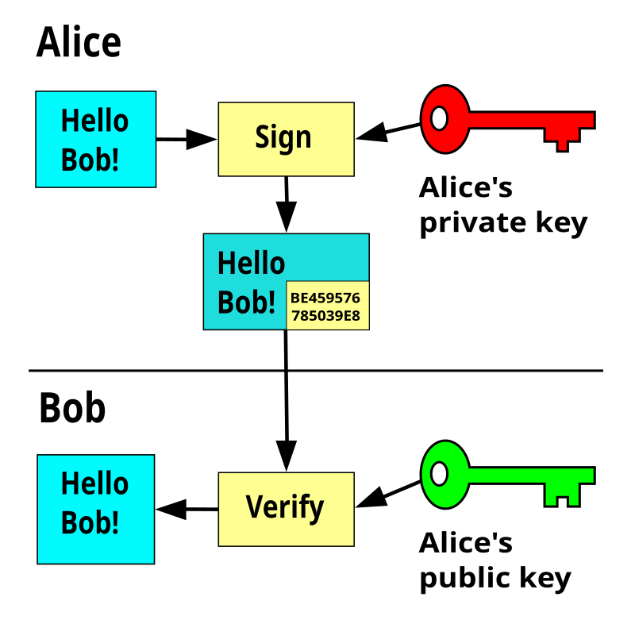

# Hoofdstuk 5: Integrity

Het verzekeren van integriteit

---

# 5.1 Digitale handtekening

---
## Digitale handtekening

-  Aan bestanden (bv: PDF) kan een **digitale handtekening** toegevoegd worden voor het verzekeren van **integriteit**.
- Hiermee kunnen twee zaken gecontroleerd worden:
    - Het bestand is **niet gewijzigd** nadat de handtekening is gegenereerd
    - Het bestand is daadwerkelijk **afkomstig van de persoon** die de handtekening heeft gegenereerd, en niet van iemand anders
- Om dit te realiseren wordt een **asymetrisch algoritme** (public-key encryption) gebruikt (zie **H4** )
---

## Hoe werkt dit?

Asymmetrische encryptie genereert een **publieke** en **private** sleutel per persoon. Deze sleutels zijn wiskundig aan elkaar gelinkt.

---

## Hoe werkt dit?

- Aan het bericht van Alice wordt een digitale handtekening toegevoegd, deze wordt geëncrypteerd met de **private sleutel** van Alice. 
- De **publieke sleutel** van Alice kan gebruikt worden om de handtekening te decrypteren. De handtekening wordt bovendien ongeldig zodra er iets wijzigt in het bericht, dus zo kan iedereen die dit wil verifieren dat het bericht niet gewijzigd is.
Omdat je de private sleutel van Alice nodig hebt om de handtekening te maken, is het bericht dus afkomstig van Alice.

Merk op dat dit geen vertrouwelijkheid (confidentiality) toevoegt, maar dit kan gerealiseerd worden door het bericht na toevoegen van de handtekening te encrypteren met de publieke sleutel van de ontvanger (Bob).
