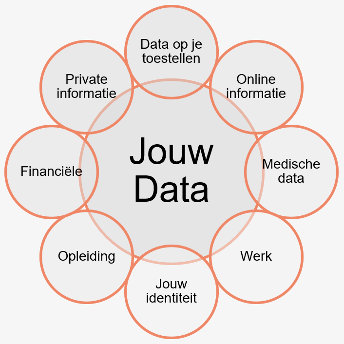
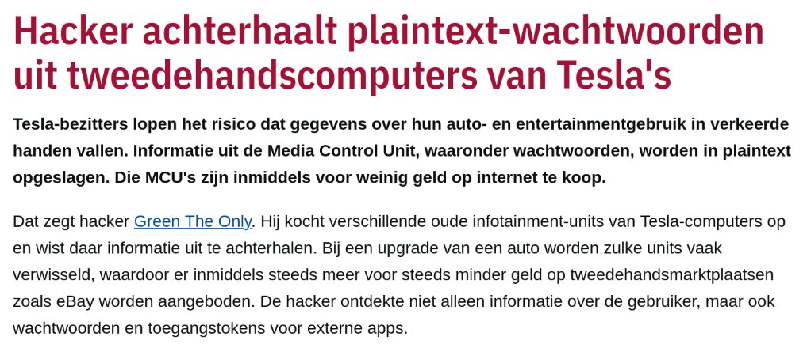
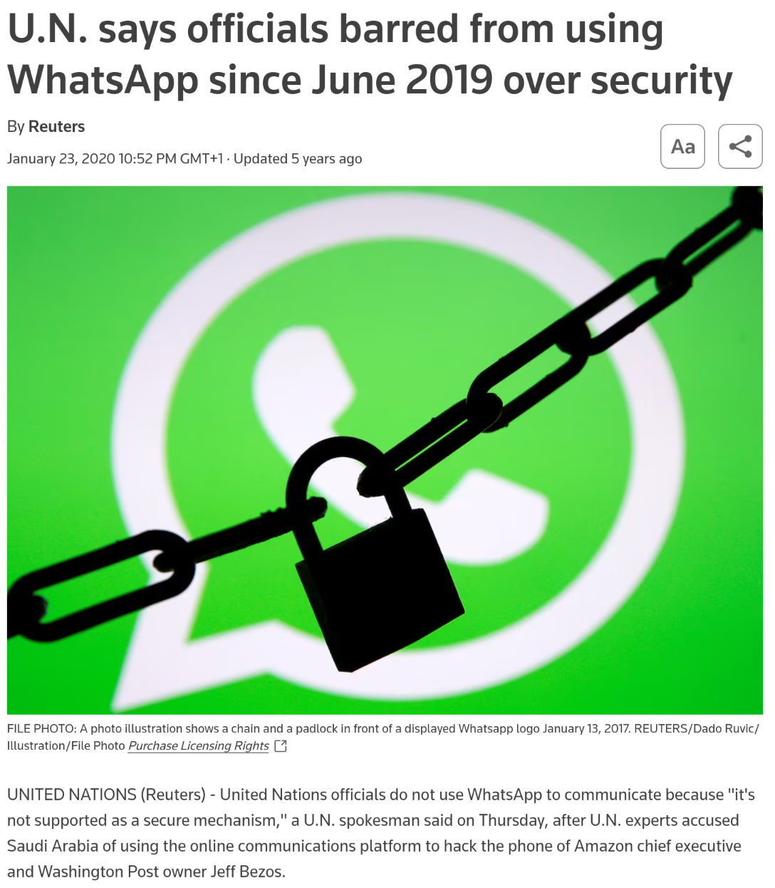
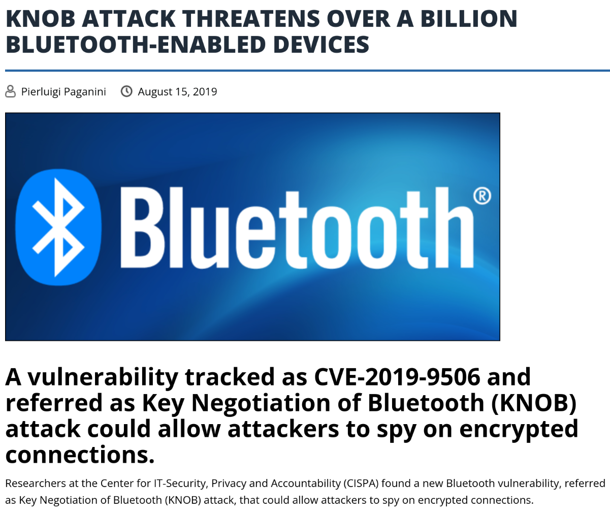
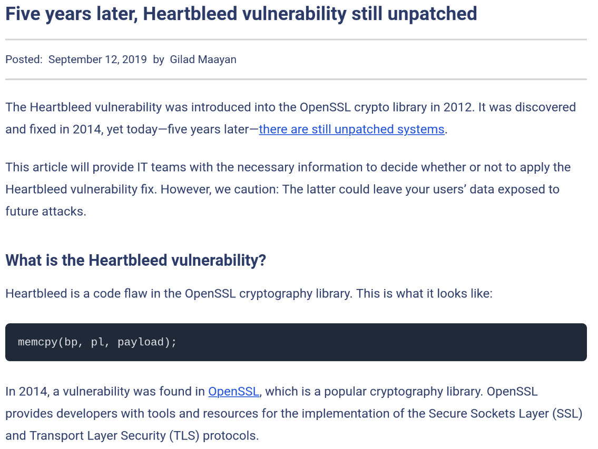
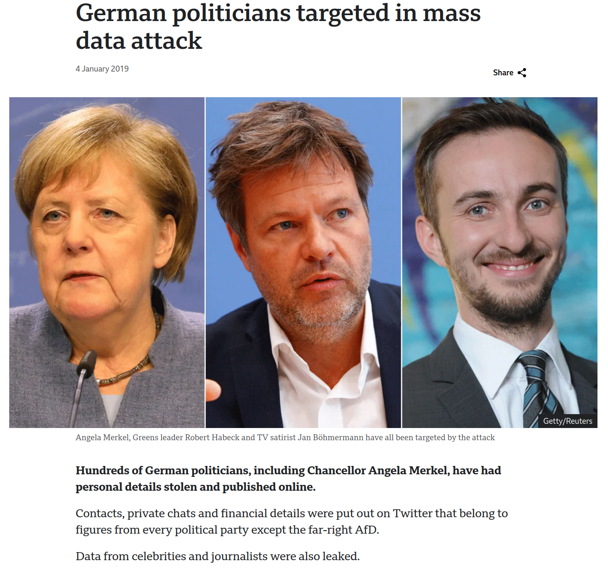
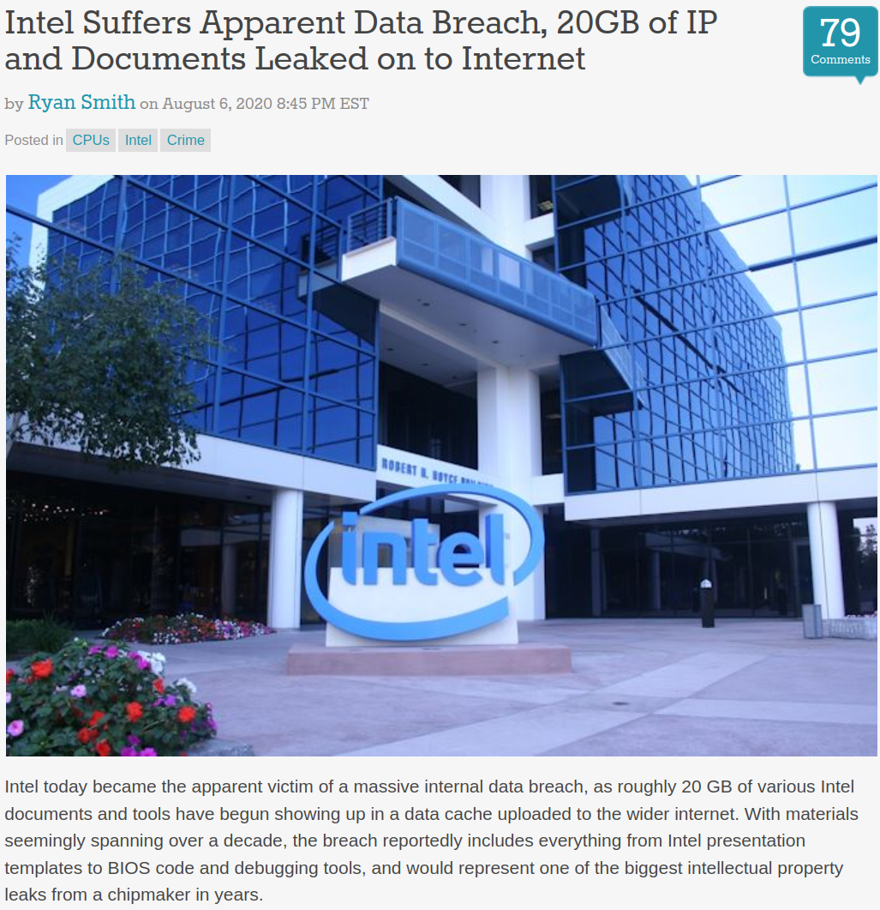
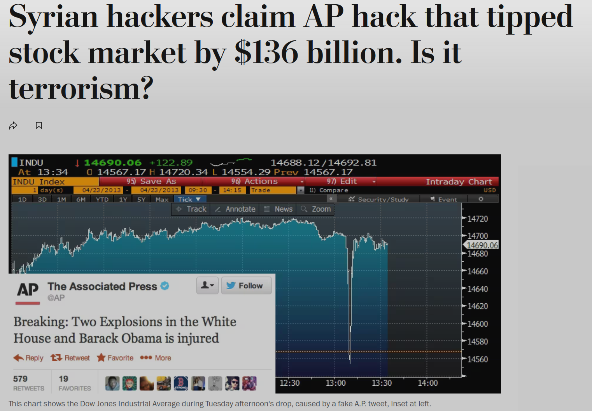

# Cybersecurity

## H1: data, het virtuele goud.

---

## Intro

-   Laten we eens kijken hoe het er bij jou aan toe gaat ...
-   https://campagne.safeonweb.be/nl/doe-de-test

---

# 1.1: Data, het virtuele goud

---

-   Het wilde westen: **goud**
-   Banken
    -   Worden beroofd
-   Goudtransporten
    -   Treinen, koetsen, ... worden aangevallen
-   Mensen
    -   Worden overvallen
    -   Inbraken
-   ...

-   Het internet: **data**
-   Grote bedrijven
    -   Worden gehackt: bv. databreaches
-   Netwerken
    -   Bv. afluisteren wifi, verspreiden malware, ...
-   Mensen
    -   Bv. phishing, gestolen laptop, ...
-   ...

---

Voor geld, uit politieke redenen, uit verveling, uit wraak, voor aanzien, ... (zie **H2**).

---

---

## Jouw data

---

## Jouw persoonlijke data

-   Een groot gedeelte van jouw data zit bij **bedrijven**:
    -   Private gegevens: chat, e-mail, foto's, ...
    -   Financiën: bankrekeningen, overschrijvingen, ...
    -   Medisch: aandoeningen, ziektegeschiedenis, medicatie, ...
    -   School: punten, verslagen, feedback, ...
    -   Werk: loon, HR, werkbestanden (bv. als zelfstandige), ...
    -   Overheid: rechtszaken, boetes, eigendom, ...

---

-   Bij welke bedrijven zit jouw data?
    -   Wie kan dit zien of aanpassen?
    -   Wat zijn de gevolgen?
    -   Wat als de data verloren geraakt?
-   Ook data op eigen toestellen of papier is gevoelig
    -   Private foto's of video's, bitcoinwallet, wachtwoorden, ...

---

Notes:

-   https://www.vrt.be/vrtnws/nl/2014/10/19/hackers_chanterensnapchat-gebruikersmetnaaktfotos-1-2123186/
-   https://www.vrt.be/vrtnws/nl/2023/03/31/ethische-hacker-waarschuwt-sleutelloze-auto-makkelijke-prooi-vo/
-   https://www.vrt.be/vrtnws/nl/2016/09/24/_hacker_stal_3_000privefotosuiticloudpippamiddleton-1-2776502/
-   https://www.vrt.be/vrtnws/nl/2019/03/29/microsoft-scam/
-   https://www.vrt.be/vrtnws/nl/2020/10/06/geef-nooit-zomaar-je-telefoonnummer-door-via-facebook-messenger/
-   https://www.vrt.be/vrtnws/nl/2023/03/07/naaktbeelden-borstkankerpatienten-amerikaans-ziekenhuis-dark-web/
-   https://www.vrt.be/vrtnws/nl/2020/02/11/makkie-facebookprofiel-van-stubru-presentator-in-5-seconden-geh/
-   https://www.vrt.be/vrtnws/nl/2013/08/18/miss_teen_usa_wordtafgeperstdooreenhacker-1-1706110/
-   https://www.vrt.be/vrtnws/nl/2023/01/09/patrick-uit-oostduinkerke-verliest-20-000-na-oplichting-via-mail/

---

## Meer dan persoonlijke data

-   Hackers zijn niet enkel geïnteresseerd in jouw data, maar ook in **industriële** data.
    -   Vaak voor losgeld of (bedrijfs)spionage
-   Een industriëel netwerk is anders dan een thuisnetwerk
    -   Meer dan enkel computers (bv. [SCADA](https://scada-international.com/what-is-scada/))

Notes:

Typische domeinen zijn onder meer:

-   Productie
    -   Branchecontroles
    -   Automatisering
    -   SCADA (Supervisory Control And Data Acquisition)
-   Energieproductie en -distributie
    -   Elektrische distributie en Smart Grid
    -   Olie en gas
-   Communicatie
    -   Telefoon
    -   E-mail
    -   Berichten
-   Transportsystemen
    -   Vliegreizen
    -   Het spoor
    -   Op de weg

Wat SCADA is wordt uitgelegd in https://www.youtube.com/watch?v=nlFM1q9QPJw . Je hoeft SCADA op zich niet te kennen, dat valt buiten de cursus. Herken wel de mogelijke impact dat een cyberaanval op zo'n systeem kan hebben.

---

Notes:

-   https://www.bbc.com/news/world-us-canada-55989843
-   https://www.dw.com/en/russian-hackers-targeted-3-us-nuclear-research-labs-report/a-64310897
-   https://www.utilitydive.com/news/sophisticated-hackers-could-crash-the-us-power-grid-but-money-not-sabotag/603764/
-   https://tweakers.net/nieuws/203832/hacker-breekt-in-in-systemen-lokale-belgische-politie-en-plaatst-data-online.html

---

## Omgaan met data

-   Bedrijven hebben de verantwoordelijkheid om deze gegevens te **beschermen**:
    -   Tegen misbruik
    -   Tegen ongeoorloofde toegang.
-   Groei in gegevensverzameling en -analyse
    -   Grote **risico's**
    -   **Voorzorgsmaatregelen** nodig
    -   Plicht om gevoelige gegevens te beschermen tegen criminelen om schade te vermijden

---

# 1.2: Staten van data

---

## Staten van data

-   Alles in de cyberwereld draait rond data. Cybersecurity specialisten focussen zich op het beveiligen van die data
-   Data heeft 3 mogelijke staten:
    -   Data in **rust**/opslag
    -   Data tijdens het **verzenden**
    -   Data tijdens het **verwerken**

---

## Data in rust

-   Data opgeslagen op **opslagapparaten** dat niet wordt gebruikt door personen of processen.
-   Opslagapparaten kunnen **lokaal** (harde schijf, USB-stick, ...) of gecentraliseerd **op afstand** aangesloten zijn (Dropbox, Google drive, NAS, ...)
-   Data kan zo **verloren** of **gestolen** worden
    -   Harde schijf kapot
    -   Laptop vergeten op trein
    -   Smartphone gestolen

---

Notes:

-   https://us.norton.com/blog/emerging-threats/biometric-data-breach-database-exposes-fingerprints-and-facial-recognition-data
-   https://www.kingston.com/belgium/us/community/articledetail/articleid/49705

---

Notes:

-   https://www.healthcareitnews.com/news/data-43000-patients-breached-after-theft-unencrypted-laptop
-   https://tweakers.net/nieuws/166742/hacker-achterhaalt-plaintext-wachtwoorden-uit-tweedehandscomputers-van-teslas.html

---

## Data tijdens verzenden

-   Verschillende manieren:
    -   **Sneaker net**: gebruikt opslagapparaten om data tussen computers over te zetten (USB-stick, draagbare harde schijf, ...)
    -   **Bedraad** netwerk: gebruikt koper- of fiberkabels
    -   **Draadloos** netwerk: gebruikt elektromagnetische golven (kan door iedereen in de buurt "gehoord" worden)

---

-   Een van de grootste uitdagingen voor cybersecurity personeel om te beveiligen.
-   Enkele uitdagingen: cybercriminelen kunnen data tijdens het verzenden ...
    -   afluisteren, kopiëren of stelen (vertrouwelijkheid)
    -   aanpassen (integriteit)
    -   verhinderen of verstoren (beschikbaarheid)

---

Notes:

-   https://www.reuters.com/article/us-un-whatsapp/u-n-says-officials-barred-from-using-whatsapp-since-june-2019-over-security-idUSKBN1ZM32P
-   https://securityaffairs.co/wordpress/89890/hacking/bluetooth-knob-attack.html

---

Notes:

-   https://thehackernews.com/2020/04/bec-scam-wire-transfer-money.html
-   https://www.aljazeera.com/economy/2022/11/25/us-bans-chinese-telecom-devices-citing-national-security
-   https://tweakers.net/nieuws/162946/criminelen-lichten-nederlands-museum-op-voor-2-komma-86-miljoen-euro-via-mailspoofing.html

---

## Data tijdens het verwerken

-   Dit omvat data tijdens de **invoer**, **aanpassing**, **berekening** of **uitvoer**
-   Organisaties gebruiken verschillende methodes om data te verzamelen:
    -   Manuele invoer, het uploaden van bestanden, dataverzameling van sensoren, ... .
    -   Elk van deze input-methode is een mogelijke bedreiging voor integriteit

---

-   Data kan aangepast worden door manuele verandering door gebruikers, programma's die de data wijzigen, defecte apparaten, ... .
    -   Voorbeelden van data-aanpassingen: encoderen/decoderen, compressie/decompressie, encryptie/decryptie, ... .
-   Data dat zodanig wordt aangepast dat het fouten bevat of onbruikbaar wordt, noemt men **corrupte** data

---

Notes:

-   https://genomebiology.biomedcentral.com/articles/10.1186/s13059-016-1044-7
-   https://datatechnologytoday.wordpress.com/2018/04/25/sql-injection-still-causing-trouble/
-   https://tweakers.net/nieuws/165340/zoom-liet-e-mailadressen-uitlekken.html
    -   Zoom heeft een slechte reputatie qua beveiliging (en privacy)
-   https://heartbleed.com/
-   https://www.threatdown.com/blog/five-years-later-heartbleed-vulnerability-still-unpatched/
-   Extra
    -   https://tweakers.net/nieuws/163166/onderzoekers-lezen-data-van-computers-door-schermhelderheid-te-manipuleren.html
    -   https://tweakers.net/nieuws/166806/wetenschappers-luisteren-pc-af-door-frequentie-van-voedingen-te-manipuleren.html

---

# 1.3: De CIA-driehoek

---

-   Niet _die_ CIA ...
-   3 principes:
    -   **C**onfidentiality (vertrouwelijkheid)
    -   **I**ntegrity (integriteit)
    -   **A**vailability (beschikbaarheid)

---

-   **Confidentiality** (vertrouwelijkheid)
    -   Wie mag dit zien?
    -   Bv. chatgesprekken, bedrijfsgeheimen, medische informatie, ... .
-   **Integrity** (integriteit)
    -   Klopt dit wel? Is de informatie juist? Komt deze van de juiste persoon?
    -   Bv. financiële transacties, contracten, ... .
-   **Availability** (beschikbaarheid)
    -   Kan ik er aan wanneer ik het nodig heb?
    -   Bv. 112-noodcentrale, chamilo.hogent.be tijdens online examen, e-mail servers, internet-toegang, ... .

---

## Confidentiality (vertrouwelijkheid)

-   Verhindert de bekendmaking van informatie aan onbevoegde personen, bronnen en processen.
-   Organisaties moeten hun personeel opleiden om zo goed mogelijk om te gaan met gevoelige informatie om zichzelf en hun organisaties te beschermen tegen aanvallen.
-   Vertrouwelijkheid kan verkregen worden door **encryptie**, **authenticatie** en **toegangscontrole**.
    -   Dit wordt uitgebreid behandeld in **H4**.

---

Notes:

-   https://www.bbc.com/news/world-europe-46757009
-   https://www.anandtech.com/show/15962/intel-data-breach-20gb-of-ip-leaked

---

---

## Integrity (integriteit)

-   Integriteit is de nauwkeurigheid, consistentie en **betrouwbaarheid** van data zolang die data bestaat. Een andere term is de kwaliteit.
-   De nood aan integriteit hangt af van de aard van de data.
    -   Bijvoorbeeld:
        -   Facebook verifieert de data in een gebruikerspost niet
        -   Transacties en bedragen bij een bank moeten steeds 100% correct zijn

---

-   Verlies van integriteit kan enorme schade brengen aan personen en organisaties, en kan databronnen onbruikbaar of onbetrouwbaar maken
-   Een integriteitscontrole is een manier om te bekijken of gegevens (bestanden, foto's, transacties, ...) nog steeds correct zijn (niet corrupt of beschadigd).
    -   Hiervoor wordt vaak een **hash functie** gebruikt.
-   Dit wordt uitgebreid behandeld in **H5**.

---

Notes:

-   https://www.britannica.com/technology/Stuxnet
    -   https://en.wikipedia.org/wiki/Stuxnet is een mooi voorbeeld! (vermoedelijke US/Israëlische staatshackers pasten machine waarden aan om nucleaire machines in Iraanse faciliteiten te vernielen)
-   https://tweakers.net/nieuws/170598/onderzoekers-kunnen-nederlandse-verkeerslichten-van-afstand-op-groen-zetten.html
-   https://www.independent.co.uk/us-election-2020/2020-election-trump-online-voting-hack-russia-mail-a9553811.html
-   https://www.nieuwsblad.be/cnt/dmf20230306_94941439
-   https://www.made-in.be/limburg/rutten-waarschuwt-hackers-vervalsen-uw-facturen/
-   https://radio2.be/lees/delphine-verliest-13500-euro-door-vervalste-factuur-nog-altijd-het-gevoel-dat-oplichters-in-mijn-computer-zitten?view=app

---

Notes:

-   https://www.washingtonpost.com/news/worldviews/wp/2013/04/23/syrian-hackers-claim-ap-hack-that-tipped-stock-market-by-136-billion-is-it-terrorism/
-   https://www.defenseone.com/threats/2015/09/next-wave-cyberattacks-wont-steal-data-theyll-change-it/120701/

---

Notes:

-   https://www.vrt.be/vrtnws/nl/2023/02/09/blunder-met-ai-chatbot-kost-google-100-miljard-dollar-op-beurs/
-   https://www.vrt.be/vrtnws/nl/2023/02/01/stemmen-klonen-via-artificiele-intelligentie/
-   https://www.vrt.be/vrtnws/nl/2023/05/26/turkse-verkiezingen-desinformatie/

---

## Availability (beschikbaarheid)

-   Informatiesystemen moeten op elk moment beschikbaar zijn.
-   Aanvallen en fouten kunnen toegang tot systemen in gevaar brengen.

---

-   Er bestaan vele maatregelen voor beschikbaarheid:
    -   redundantie, backups, verhoogde weerstand, onderhoud, up-to-date software en OS, noodplannen om terug online te komen na een onvoorziene omstandigheid, gebruik van nieuwe technologieën, detectie ongebruikelijke activiteit en beschikbaarheidstesten, ... .
-   Dit wordt uitgebreid behandeld in **H6**.

---

TODO

Notes:

-   https://tweakers.net/nieuws/171896/kaspersky-leeromgevingen-zijn-vaker-doelwit-van-ddos-aanvallen.html
-   https://datanews.knack.be/ict/nieuws/ddos-aanval-treft-edpnet/article-news-1635675.html?cookie_check=1600001131
-   https://tweakers.net/nieuws/171594/belgische-provider-edpnet-heeft-al-vier-dagen-te-maken-met-ddos-aanvallen.html
-   https://issues.edpnet.be/?p=3099 

Je kan zelf kijken waar en wanneer er DDoS-aanvallen plaats vonden. Neem gerust een kijkje op https://www.digitalattackmap.com/ voor DDos-aanvallen, of https://cybermap.kaspersky.com/ voor allerlei soorten aanvallen.

---

TODO

Notes:

-   https://www.techradar.com/news/aws-stops-largest-ddos-attack-ever
-   https://www.bbc.com/news/technology-35204915
-   https://github.blog/2018-03-01-ddos-incident-report/
    

---

TODO

Notes:

-   https://hotforsecurity.bitdefender.com/blog/patient-dies-after-ransomware-attack-on-dusseldorf-hospital-24159.html
-   https://www.vrt.be/vrtnws/nl/2023/02/22/duitse-politie-valt-bij-extreemrechtse-groep-binnen-die-black-ou/ 

---

# 1.5 De cybersecurity kubus

---

-   Cybersecurityspecialisten proberen data in al zijn staten beschermen voor elk aspect van de CIA-driehoek.
-   Dit doen ze aan de hand van verschillende **beveiligingsmaatregelen** op vlak via technologie, beleid en personeel.

---

|                 | In rust      | Tijdens verzenden | Tijdens verwerking |
| --------------- | ------------ | ----------------- | ------------------ |
| Confidentiality | Data veilig? | Data veilig?      | Data veilig?       |
| Integrity       | Data veilig? | Data veilig?      | Data veilig?       |
| Availability    | Data veilig? | Data veilig?      | Data veilig?       |

---

-   Om bij het ontwerpen van een beveiligsplan niets te vergeten, wordt dit vaak gevisualiseerd als een kubus met 3 zijden:
    -   Beveiligingsprincipes (== de CIA-driehoek)
    -   De staten van data
    -   Beveiligingsmaatregelen
-   De kubus staat ook bekend als de McCumber Cube.

---

# Extra: de meest gebruikte securitymaatregel, een wachtwoord

---

## Intro

-   Laten we eens kijken hoe het er bij jou aan toe gaat ...
-   https://safeonweb.be/nl/wachtwoordtest

---

---

## Wat is volgens jou een goed wachtwoord?

-   Musti2012
-   A8!Kgh3
-   Ikstudeerophogent
-   SchoonmeersenHOGENT
-   8765

-   LiefKleinKonijntje
-   LiefKlijnKoneintje
-   Shadow1Hogent
-   Shadow1Facebook
-   kmAIw0IlCUvX5nk9

---

-   Musti2012 &rarr; te kort, voorspelbaar
-   A8!Kgh3 &rarr; te kort
-   Ikstudeerophogent &rarr; voorspelbaar
-   SchoonmeersenHOGENT &rarr; voorspelbaar
-   8765 &rarr; te kort, weinig complexiteit
-   LiefKleinKonijntje &rarr; lang, NL (zolang de woorden random gekozen zijn)
-   LiefKlijnKoneintje &rarr; lang, NL, typfout (zie hierboven)
-   Shadow1Hogent &rarr; Truucjes helpen niet
-   Shadow1Facebook &rarr; Truucjes helpen niet
-   kmAIw0IlCUvX5nk9 &rarr; Ok! Kan je het onthouden?

---

-   https://www.vrt.be/vrtnws/nl/kijk/2022/05/13/mini-check-tweestapsverificatie-v03-arvato_48836063/
-   Experimenteer even met volgende links, maar steek hier niet jouw echte wachtwoorden in!
    -   https://bitwarden.com/password-generator/
    -   https://bitwarden.com/password-strength/
-   Best gebruik je ook **2-FA**
    -   Dit komt in een later hoofdstuk aan bod

---

Notes:

-   https://www.hivesystems.io/blog/are-your-passwords-in-the-green

---

Notes:

-   https://twitter.com/TerahashCorp/status/1155112559206383616/photo/1
-   Dit is een richtlijn, de daadwerkelijke tijd hangt af van het system, software, ... waarmee je het wachtwoord zou willen kraken.

---

-   De **lengte** is dus heel belangrijk!
-   Nog beter dan een wachtwoord is een **wachtzin** (**passphrase**)
    -   "Purple Elephants Sliding Over Clouds"
    -   "3@pples&Or@nges#Ban@nas"
    -   "Chocolate Cake Is My Favourite dess3rt"
-   https://useapassphrase.com

---

## Hoeveel wachtwoorden?

Notes:

-   https://xkcd.com/792/

---

-   Gebruik voor elke website een **apart** wachtwoord!
-   Bij **datalekken** worden vaak wachtwoorden op straat gegooid
    -   Niet alle bedrijven zijn even zorgvuldig met hun beveiliging (of beveiligen niet!)
    -   Hackers proberen deze wachtwoorden (geautomatiseerd) uit op andere sites
    -   Hetzelfde wachtwoord gebruikt, kans groot dat ze op jouw andere accounts ook binnengeraken

---

-   Gebruik **geen** trucjes
    -   Bv. hogent19jan2023, google1nov1998, ...
    -   Tools zoals hashcat en AI-hacktools herkennen dit meteen en kunnen zo al een gedeelte van het wachtwoord achterhalen
    -   De effectieve ongekende lengte van het wachtwoord wordt een pak kleiner

Notes:

-   `hogent19jan2023`, `google1nov1998` &rarr; website + dag + maand + jaar
    -   31 mogelijke dagen x 12 mogelijke maanden x 10000 mogelijke jaren == 3720000 mogelijkheden == 1 uur om te kraken bij 1000 mogelijkheden / sec
-   14 random karakters [kleine letters, hoofdletters, leestekens, ...
    -   == 128^14 == 316912650057057350374175801344 mogelijkheden == +/- 10049234210332869000 jaar om te kraken bij 1000 mogelijkheden / sec

---

## Hoe onthouden?

-   **Password managers** zijn zeker een goede oplossing
-   Voordelen:
    -   Jouw wachtwoorden worden **versleuteld** opgeslagen
    -   Je kan voor elke login een **aparte** username en wachtwoord instellen (niet vertrouwen op geheugen of post-it op scherm)
    -   Heeft een ingebouwde password **generator**
-   Vult wachtwoorden **automatisch** aan in de browser

---

-   Nadelen:
    -   Je **master password** is nu extreem belangrijk
    -   Je **vertrouwt** het bedrijf achter de password manager
    -   De software / plugins moet je 100% vertrouwen, en deze kunnen ook **bugs** hebben

---

Beter een password manager dan overal hetzelfde wachtwoord of voor de hand liggende variaties!

 

---

## Password policies

  

Notes:

-   https://www.starlab.io/blog/why-enforced-password-complexity-is-worse-for-security-and-what-to-do-about-it

---

-   Bedrijven hebben vaak password policies waardoor je je wachtwoord **regelmatig** moet **wijzigen**
-   Volgende wachtwoordwijziging doe je best niet elke maand of je personeel heeft wachtwoorden als ...
    -   January123, February123, ...
    -   Summer2023
-   Op die manier heeft wachtwoorden wijzigen **geen zin**
-   Wordt tegenwoordig ook **afgeraden** (bv. door NIST)
-   https://neal.fun/password-game

Notes:

-   https://arstechnica.com/information-technology/2016/08/frequent-password-changes-are-the-enemy-of-security-ftc-technologist-says/
-   https://bitwarden.com/resources/world-password-day/
-   https://www.beyondtrust.com/blog/entry/top-15-password-management-best-practices
-   https://nordpass.com/poor-company-passwords/
-   https://bishopfox.com/blog/password-security

---

## Tip voor programmeurs!

-   Introduceer **time-delay** bij inlogpogingen
    -   Bv. Als een persoon een foutief wachtwoord ingeeft, zorg dat er een wachttijd is van 5 seconden.
-   Dit gaat **bots/scripts** tegen en de kans is groot dat de gebruiker het nooit zal merken!

---

| Nr. of attacks                                               | Password    | Time       | Security level |
| ------------------------------------------------------------ | ----------- | ---------- | -------------- |
| 100 times per second                                         | Blablabla_1 | 2 months   | Low            |
| 1 time every 5 seconds                                       | Blablabla_1 | 63 years   | Secure         |
| 1 time every 5 seconds with 1 hour penalty after 10 attempts | Blablabla_1 | 1800 years | Very Secure    |

---

## Tip voor systeembeheerders!

-   Introduceer programma's die bepaalde verbindingen blokkeren bij teveel pogingen
    -   Bv. Als iets 5x probeert in te loggen met een foutief wachtwoord in 20 minuten, wordt deze genegeerd voor 6 uur

